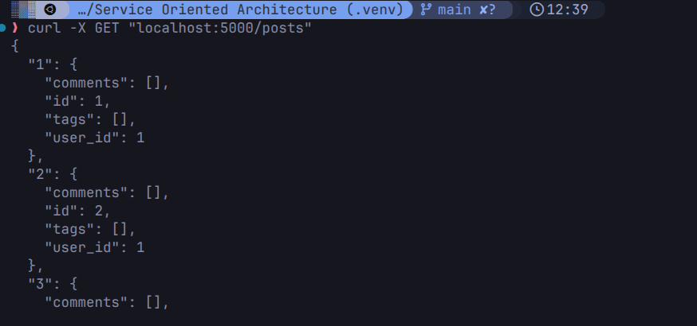
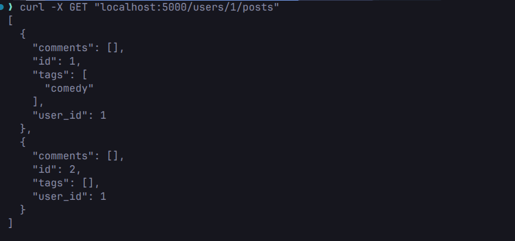
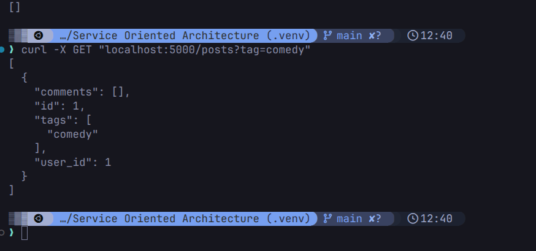
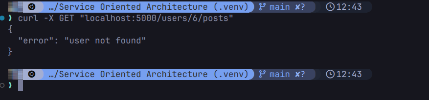
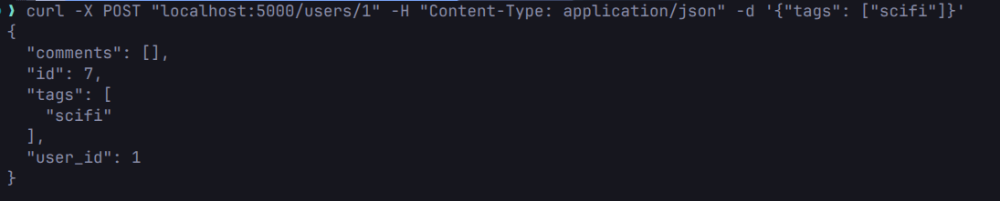
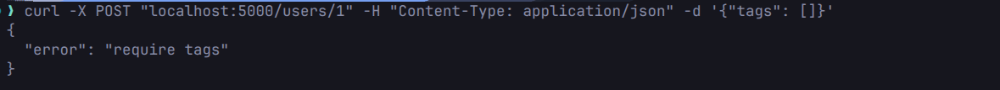

# Thiết Kế resource the Blog API

## 1. Xác Định Các Resources Trong Miền Bài Toán

Dựa trên yêu cầu hệ thống blog, resources chính được xác định bao gồm:

* **Users**: 
* **Posts**: 
* **Comments**: 
* **Tags**: 
* **Followers / Following**

---

## 2. Phân Loại Collection / Item / Sub-resource

* **Collection**: `/posts`.
* **Item** `/posts/{post_id}`
* **Sub-resource (Collection)** : `/posts/{post_id}/comments`.
* **Sub-resource (Item)** : `/posts/{post_id}/comments/{comment_id}`.
* **Sub-resource (Relationship)** : `/users/{user_id}/followers`.
* **Sub-resource (Relationship)** : `/users/{user_id}/following`.
* **Collection / Sub-resource (Tags)** : `/posts/{post_id}/tags`.

## 3. Endpoint tree & Version segment
* /users
    * /followers
    * /following
    * /posts
        * /comments
        * /tags

* /api
    * /v1
    * /v2

## 4. Flask routes cho posts
* **GET posts**
    *  
    *  
    *  
    *  
* **POST post**
    *  
    *  
    *  