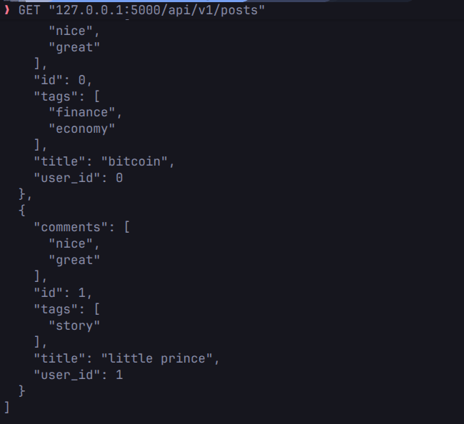
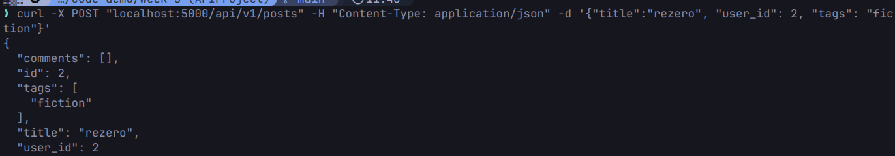

# Thiết Kế RESTful API - Nền Tảng Blog

## 1. Xác Định Các Resources Trong Miền Bài Toán

Dựa trên yêu cầu hệ thống blog, các tài nguyên (resources) chính được xác định bao gồm:

* **Users**: Người dùng / Tác giả bài viết trên hệ thống.
* **Posts**: Các bài viết do người dùng tạo và đăng tải.
* **Comments**: Bình luận của người dùng dành cho một bài viết cụ thể.
* **Tags**: Các thẻ phân loại được gắn kèm vào bài viết.
* **Followers / Following**

---

## 2. Phân Loại Collection / Item / Sub-resource

**Collection**: `/posts`
**Item** `/posts/{post_id}` Quản lý một bài viết cụ thể theo ID
**Sub-resource (Collection)** : `/posts/{post_id}/comments`
**Sub-resource (Item)** : `/posts/{post_id}/comments/{comment_id}`
**Sub-resource (Relationship)** : `/users/{user_id}/followers`
**Sub-resource (Relationship)** : `/users/{user_id}/following`
**Collection / Sub-resource (Tags)** : `/tags` `/posts/{post_id}/tags`

## 4. Flask routes cho posts

